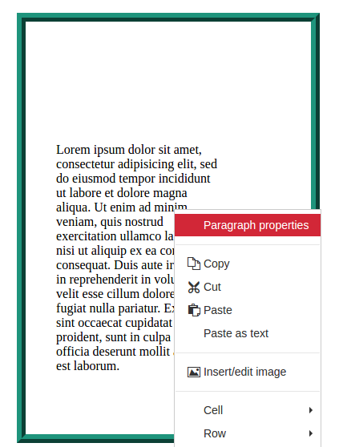
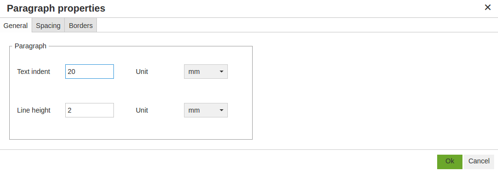
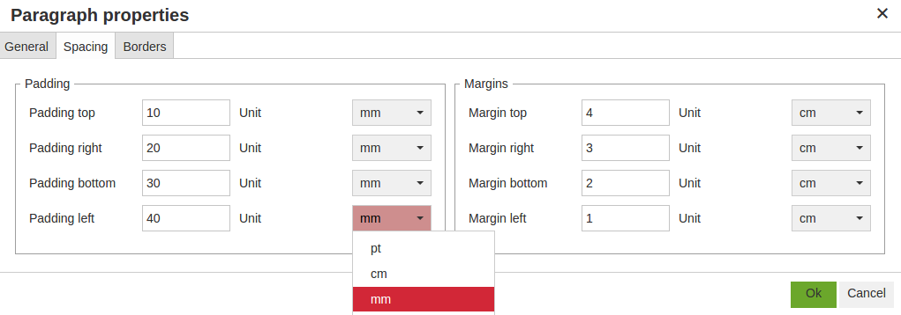
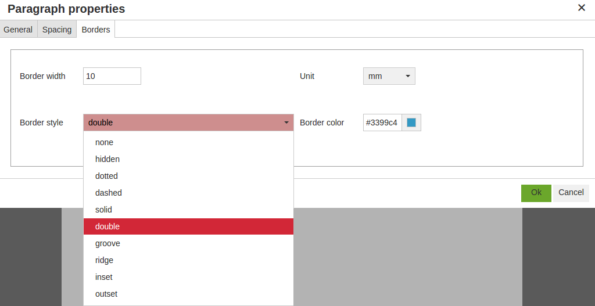

# Tinymce Plugin Paragraph

[](git@github.com:sirap-group/tinymce-plugin-paragraph.git)
[](https://www.npmjs.com/package/tinymce-plugin-paragraph)
[](https://github.com/sirap-group/tinymce-plugin-paragraph)

[](http://standardjs.com/)
[](http://semver.org/)
[](https://github.com/sirap-group/tinymce-plugin-paragraph)

A plugin for the open source [tinymce WYSIWYG HTML editor](https://github.com/tinymce/tinymce) that allow to edit paragraph properties.

## Screenshots

### Contextual menu

Open the "Paragraph properties" window in the contextual menu opened on a paragraph.



### General tab



### Spacing tab



### Borders tab



## Installation

## With package managers (recommanded)

    bower install tinymce-plugin-paragraph --save

or

    npm install tinymce-plugin-paragraph --save

## Or manually

Download

    wget https://github.com/sirap-group/tinymce-plugin-paragraph/archive/v0.5.0.zip
    unzip v0.5.0.zip
    mv tinymce-plugin-paragraph-v0.5.0 public/lib/tinymce-plugin-paragraph

### Configure your app

```html
<script type="text/javascript" src="lib/tinymce-plugin-paragraph/plugin.min.js"></script>
```

```javascript
tinymce.init({
  selector: "textarea",  // change this value according to your HTML
  plugins: "paragraph"
});
```

## Developement

[](https://github.com/feross/standard)

The javascript source files are located in the `src` folder.
We use the [Standard Javascript Code Style](http://standardjs.com/) to keep the code clean and nice and [browserify](http://browserify.org/) to keep it modular and well organized.
Finally, we use [Grunt](http://gruntjs.com/) to run the developement tasks:

- [grunt-standard](https://github.com/pdehaan/grunt-standard) to lint the source files in `src`,
- [grunt-browserify](https://github.com/jmreidy/grunt-browserify)
to bundle it to the `plugin.js` file.
- [grunt-contrib-uglify](https://github.com/gruntjs/grunt-contrib-uglify) to minimize `plugin.js` to `plugin.min.js`
- [grunt-bump](https://github.com/vojtajina/grunt-bump) to increment the version number, updating `package.json`, `bower.json` and creating a new `git tag`.

We use the [Semver 2.0](http://semver.org/) (Semantic Versioning) to standardize the release version numbers (major/minor/path/pre-release).


## License

According to the main project, [tinymce](https://github.com/tinymce/tinymce), this plugin is open sourced and is licensed under the [LGPL-v2](LICENSE) (GNU Lesser General Public License V2.1)
